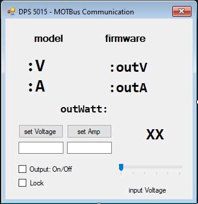
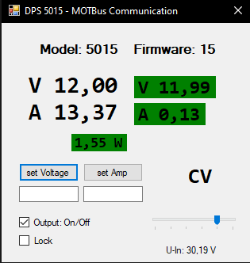

# MODBUS Test

GER:
Ich habe erfolgreich versucht eine Verbindung zu einem Netzteil von RUIDEN (5015) herzustellen,
um das Netzteil über mein Programm fernzusteuern.
Es sollten auch alle anderen Netzteile von RUIDEN funktionieren,
sofern man über den COM-Port darauf zugreifen kann.

Ich habe an meinem DPS 5015 ein Bluetooth board verbaut und die offizielle App installiert
um die Treiber zu haben, der dann einen COM-Port bereitstellt.

ENG:
I successfully attempted to connect to a RUIDEN (5015) power supply to remotely control it through my program.
Other RUIDEN power supplies should also work, as long as they can be accessed via the COM port.

I have installed a Bluetooth board on my DPS 5015 and set up the official app to obtain the drivers, 
which then provides a COM port.

## Features
+ Voltage / Current Control
+ Displays all you need to know

## Oopsies
- control is slow even with high Baudrate
- GUI Layout is ugly as hell

## Getting Started
Just download and open the .sln with Visual Studio
look through it and compile by yourself.

## License
MIT License